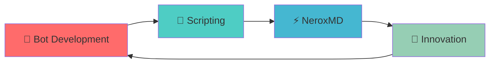

# 🌟 Hi there, I'm **neroxboys**! 👋

<div align="center">
  
</div>

<div align="center">
  
  [](https://git.io/typing-svg)
  
</div>

<div align="center">
  
  
  
</div>

---

## 🚀 About Me

```javascript
const neroxboys = {
    name: "neroxboys",
    role: "Developer & Script Specialist",
    focus: ["Scripting", "Bot Development", "NeroxMD"],
    mission: "Creating innovative and efficient solutions 🎯",
    collaboration: "Open to global partnerships 🌍",
    motto: "Code with passion, build with purpose! 💪"
};
```

<div align="center">
  
</div>

---

## 🛠️ Tech Arsenal

<div align="center">

### 💻 Programming Languages


### 🎨 Frontend Frameworks


### ⚙️ Backend & APIs


### 🗄️ Databases


### 🔧 Tools & Platforms


</div>

---

## 📊 GitHub Statistics

<div align="center">
  
  
</div>

<div align="center">
  
</div>

---

## 🏆 Featured Projects

<div align="center">

[](https://github.com/neroxkira/gimbwal)
[](https://github.com/neroxkira/web)
[](https://github.com/neroxkira/datagame)
[](https://github.com/neroxkira/MusicRandom)

</div>

### 🌟 Project Highlights

| Project | Description | Stars | Language |
|---------|-------------|-------|----------|
| **[gimbwal](https://github.com/neroxkira/gimbwal)** | 🎮 Advanced game development project | ⭐ 12 | JavaScript |
| **[nerox0817](https://github.com/neroxkira/nerox0817)** | 🤖 Showcase of various scripts and bots | ⭐ 1 | Shell |
| **[web](https://github.com/neroxkira/web)** | 🌐 Modern web application | ⭐ 0 | JavaScript |
| **[MusicRandom](https://github.com/neroxkira/MusicRandom)** | 🎵 Smart music randomizer tool | ⭐ 0 | Multi-language |
| **[datagame](https://github.com/neroxkira/datagame)** | 📊 Dynamic data-driven game | ⭐ 0 | Multi-language |

---

## 📈 Activity & Contribution

<div align="center">
  
</div>

### 🔥 Recent Activity
- 🚀 Pushed to [gimbwal](https://github.com/neroxkira/gimbwal)
- ✨ Created repository [MusicRandom](https://github.com/neroxkira/MusicRandom)
- 🔄 Updated [web](https://github.com/neroxkira/web)
- 🤝 Contributed to [nerox0817](https://github.com/neroxkira/nerox0817)
- 🎯 Closed issues in [datagame](https://github.com/neroxkira/datagame)

---

## 🎯 Current Focus

<div align="center">


```mermaid
graph LR
    A[🤖 Bot Development] --> B[📝 Scripting]
    B --> C[⚡ NeroxMD]
    C --> D[🚀 Innovation]
    D --> A
    
    style A fill:#ff6b6b
    style B fill:#4ecdc4
    style C fill:#45b7d1
    style D fill:#96ceb4
```

</div>

- 🔥 Enhancing **NeroxMD** with new features
- 🎮 Developing interactive gaming experiences
- 🤖 Creating intelligent automation bots
- 🌐 Building responsive web applications
- 📱 Exploring mobile development

---

## 🌐 Connect with Me

<div align="center">

[](https://github.com/neroxkira)
[](https://discord.gg/your-server)
[](https://t.me/your-username)
[](mailto:your-email@example.com)

</div>

---

## 💡 Fun Facts

<div align="center">

🎯 **Mission**: Creating innovative solutions that enhance user experiences  
🌍 **Collaboration**: Open to working with developers worldwide  
⚡ **Specialty**: NeroxMD and automation scripts  
🔥 **Passion**: Turning ideas into reality through code  

</div>

---

<div align="center">
  
</div>

<div align="center">
  
  **⭐ If you like my work, consider giving a star to my repositories! ⭐**
  
  
  
</div>

---

<div align="center">
  <sub>💖 Made with passion by neroxboys | Last updated: 2025</sub>
</div>
